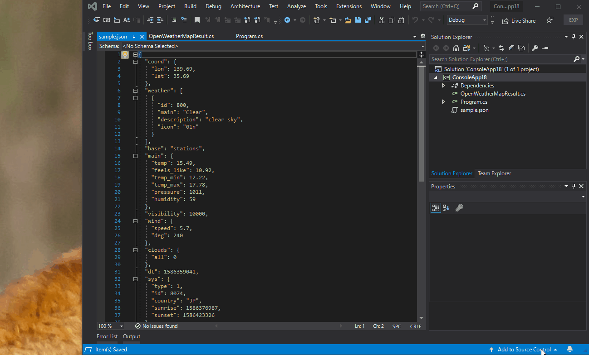

# Quicktype extension for Visual Studio

This is a quicktype extension for Visual Studio 2019.
If you don't know quicktype, plese check below site:

https://quicktype.io

## How to user

1. Install quicktype to your machine using `npm install -g quicktype`.
2. Install this extension to your Visual Studio.
3. Copy a JSON text to clipboard.
4. Open a file on Visual Studio.
5. Select [Edit] -> [Paste JSON as Code].

